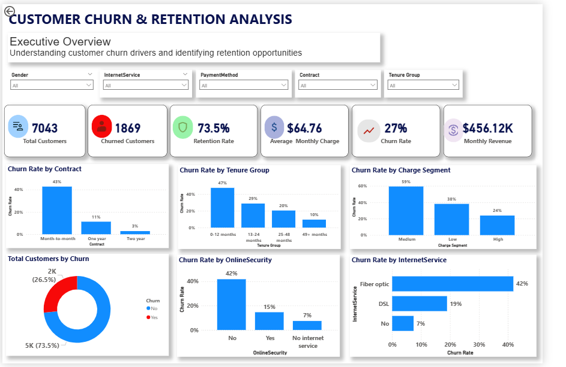

# Customer Churn & Retention Analysis

## 📊 Project Overview

This project analyses customer churn and retention patterns using a telecommunications customer dataset. The objective is to identify customer segments associated with higher churn and generate actionable insights that can support customer retention strategies.

The analysis was developed in Power BI using Power Query for data preparation and DAX for analytical measures.

## 🎯 Business Problem

Customer churn can negatively affect recurring revenue and long-term customer value. This analysis investigates:

- Which customer segments have the highest churn rates?
- How does churn vary by contract type and customer tenure?
- Is churn associated with service adoption and customer charges?
- Which areas could be prioritised for customer retention efforts?

## 🗂️ Dataset

The dataset contains **7,043 customer records** and includes demographic, service, contract, billing and churn-related information.

Key fields include:

- Customer demographics
- Customer tenure
- Contract type
- Internet and additional services
- Payment method
- Monthly and total charges
- Administrative and technical support tickets
- Churn status
🧹 Data Preparation

The dataset was prepared in Power Query before analysis. The main data preparation steps included:

- Removing duplicate records
- Checking for missing and inconsistent values
- Correcting data types
- Reviewing categorical fields for consistency
- Creating appropriate numerical and categorical fields for analysis
- Validating the dataset before loading it into the Power BI data model

These steps helped ensure that the dataset was suitable for reliable analysis and visualisation.
📊 Dashboard

The interactive Power BI dashboard provides an overview of customer churn patterns and highlights key factors associated with customer retention.

Key Dashboard Areas

- Overall customer churn rate
- Churn distribution by contract type
- Churn by customer tenure
- Churn by internet service
- Churn by payment method
- Customer charges and service patterns
- Customer demographic segments

The dashboard was designed to provide a clear view of churn patterns and help identify customer groups that may require targeted retention strategies.
## 📸 Dashboard Preview

